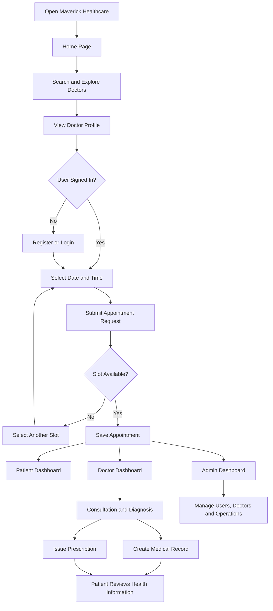
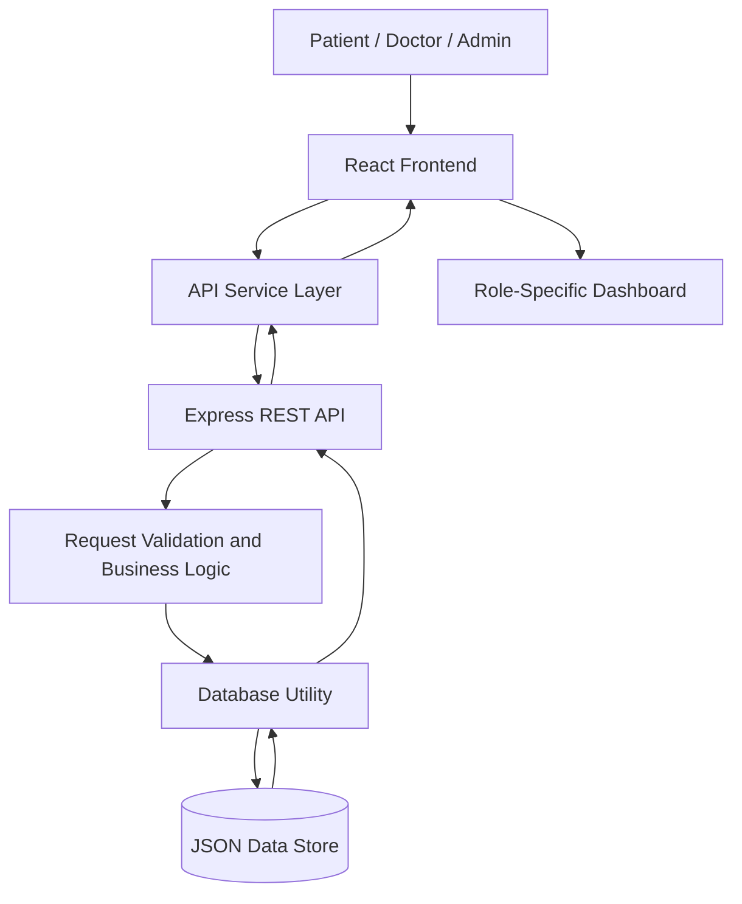

# 🏥 Maverick Healthcare
### Smart Healthcare Management & Doctor Appointment Platform

Maverick Healthcare is a full-stack healthcare management application designed to connect patients, doctors, and administrators through a unified digital platform. It simplifies doctor discovery, appointment scheduling, patient record management, digital prescriptions, and clinical administration.

The application provides role-based dashboards that allow each user to access the features relevant to their responsibilities.

---

## 📌 Project Overview

Traditional healthcare workflows can involve manual appointment scheduling, scattered patient records, and time-consuming coordination between patients, doctors, and hospital administrators.

Maverick Healthcare brings these workflows together in one application. Patients can discover specialists and request appointments, doctors can manage consultations and clinical information, and administrators can oversee users, doctors, appointments, and platform activity.

### 🎯 Main Objectives

- Simplify the process of finding and booking medical specialists.
- Organize appointment scheduling and status tracking.
- Maintain digital medical records and prescriptions.
- Provide separate dashboards for patients, doctors, and administrators.
- Improve visibility into healthcare operations through centralized management.
- Make healthcare information easier to access and manage.

---

## ✨ Key Features

### 1. Doctor Discovery

Patients can explore available medical specialists and review information such as:

- Doctor name and specialization.
- Qualifications and professional experience.
- Hospital affiliation and location.
- Consultation fees.
- Available days and time slots.
- Doctor profiles and reviews.

Search and filtering features help patients narrow down doctors according to their requirements.

### 2. Appointment Management

The appointment system allows patients to select a doctor, choose an available date and time, and submit an appointment request.

The application checks doctor availability and existing reservations to prevent conflicting bookings. Appointment information is then available for tracking and management.

### 3. Patient Dashboard

The patient dashboard provides a centralized view of the patient's healthcare activity, including:

- Appointment information and status.
- Consultation history.
- Medical records and diagnoses.
- Digital prescriptions.
- Personal profile information.
- Notifications and relevant updates.

### 4. Doctor Dashboard

Doctors can use their dashboard to manage clinical activities, including:

- Reviewing their appointment schedule.
- Accessing relevant patient information.
- Updating appointment statuses.
- Recording diagnoses and consultation notes.
- Creating medical records.
- Issuing digital prescriptions.

### 5. Administrator Dashboard

The administrator dashboard provides management features for overseeing the platform.

- View system statistics and operational summaries.
- Create, view, update, and remove user accounts.
- Manage doctor profiles and specialist information.
- Review and manage appointments.
- Access patient records.
- Moderate doctor reviews.
- Monitor appointment trends and other platform metrics.

### 6. Medical Records and Digital Prescriptions

The application maintains structured medical information associated with patients and their consultations.

Doctors can record clinical information and create prescriptions containing medication details, dosage, frequency, and duration where provided. Prescription and medical record information can be reviewed through the relevant dashboard.

### 7. Reviews and Ratings

The application supports doctor reviews and ratings, helping patients evaluate specialists. Administrative review moderation is also available.

### 8. Notifications and Profile Management

Users can access notifications and manage relevant profile information. The application maintains client-side session information to support returning users and role-specific navigation.

### 9. System Architecture Viewer

The application includes an interactive architecture viewer that presents information about system components, data structures, and application flows.

---

## 👥 User Roles

Maverick Healthcare supports three primary user roles.

| User Role | Main Responsibility |
|---|---|
| **Patient** | Discover doctors, book appointments, view medical history, and access prescriptions. |
| **Doctor** | Manage appointments, review patient information, record diagnoses, and issue prescriptions. |
| **Administrator** | Manage users, doctors, appointments, reviews, and system-level information. |

Each role is directed to its corresponding dashboard after successful authentication.

---

## 🔄 Complete Application Workflow

### Step 1: User Enters the Application

The user opens Maverick Healthcare and reaches the home page.

The home page introduces the platform and provides access to doctor discovery, specialist categories, search functionality, and authentication.

### Step 2: Doctor Discovery

A patient navigates to the doctor listing page and searches for a suitable specialist.

The patient can use the available search and filtering options to find doctors based on specialization, location, or other displayed details.

The application retrieves doctor information from its backend and displays the matching results.

### Step 3: Doctor Profile Review

The patient selects a doctor to view more detailed information.

The profile provides relevant details such as qualifications, experience, hospital, consultation fees, and availability.

The patient can proceed to the appointment booking process.

### Step 4: Authentication

If the patient is not signed in, the application opens the authentication interface before completing the booking flow.

Users can register or sign in using the available authentication form. The application identifies the user's role and directs the user to the appropriate dashboard.

If a patient started booking a specific doctor before signing in, the application is designed to retain that booking context during authentication.

### Step 5: Appointment Booking

The patient selects a suitable date and available time slot, then provides the requested consultation information, such as the reason for the visit and additional notes.

The application sends the booking request to the backend.

The backend validates the booking information and checks the requested appointment against existing reservations and doctor availability. If the slot is available, the appointment is saved and a successful booking response is returned. If the slot conflicts with an existing reservation, the application can reject the request.

### Step 6: Appointment Tracking

After a booking is accepted, the appointment becomes part of the patient's appointment history and can be retrieved through the patient dashboard.

The doctor can review relevant appointments through the doctor dashboard. Administrators can also review appointment information through the administrative interface.

### Step 7: Doctor Consultation

The doctor reviews the appointment and relevant patient information.

During or after the consultation, the doctor can update the appointment status and record clinical information, including diagnoses and consultation notes.

The application provides interfaces for managing medical records and prescriptions associated with the patient's care.

### Step 8: Medical Record Creation

Clinical information is stored as structured medical record data through the backend.

The relevant records can be retrieved using patient or doctor associations, allowing the application to display consultation information to the appropriate dashboard.

### Step 9: Prescription Management

The doctor can create a digital prescription with the available medication and dosage information.

The prescription is saved through the backend and can subsequently be retrieved through the patient or doctor prescription views.

### Step 10: Administrative Oversight

The administrator oversees platform activity through the administration dashboard.

The administrator can manage user accounts and doctor profiles, inspect appointments and patient records, moderate reviews, and review system statistics.

### Step 11: Notifications and Session Management

The application can retrieve notifications for the signed-in user. Notification controls allow users to access updates and mark supported notifications as read.

Session-related information is stored in the browser to help restore the user interface when the application is revisited. Logging out clears the application's stored session information and returns the user to the public home page.

---

## 🔀 Overall Workflow Diagram

---

## 🏗️ System Architecture

Maverick Healthcare follows a frontend-backend architecture.

### Frontend Layer

The frontend is responsible for displaying the user interface, handling user interactions, managing dashboard navigation, and presenting information received from the backend.

**Technologies:**
- React 19
- TypeScript
- Vite
- Tailwind CSS
- Lucide React
- Motion

### Backend Layer

The backend processes API requests, performs application-level validation, manages authentication-related flows, and coordinates operations involving users, doctors, appointments, medical records, prescriptions, reviews, and notifications.

**Technologies:**
- Node.js
- Express.js
- TypeScript
- TSX

### Data Layer

The current backend uses a JSON file as its primary data store.

The file `data/careconnect_db.json` contains structured application data, including user accounts, doctor profiles, and other healthcare-related entities. The backend reads and updates this data through its database utility.

### Architecture Flow

---

## 🔁 Data Flow

The application follows a request-response model.

1. A user performs an action through the frontend.
2. The frontend calls the relevant API through the centralized API service.
3. The backend receives the request and processes the required operation.
4. The backend reads or updates the application's stored data.
5. The backend returns a response indicating the result.
6. The frontend updates the relevant interface with the returned information.

For example, during appointment booking, the frontend sends the selected patient, doctor, date, time, and consultation details to the appointment endpoint. The backend checks the request, processes the booking, and returns the result for the interface to display.

---

## 🧩 Main Application Modules

| Module | Purpose |
|---|---|
| Authentication | Registration, login, and user session handling. |
| Doctor Directory | Doctor listings, search, filtering, and profiles. |
| Appointment Management | Booking, retrieval, cancellation, and status updates. |
| Patient Management | Patient profiles and associated healthcare information. |
| Medical Records | Storage and retrieval of diagnoses and clinical notes. |
| Prescription Management | Creation and retrieval of digital prescriptions. |
| Reviews | Doctor feedback, ratings, and moderation. |
| Notifications | Retrieving notifications and tracking read status. |
| Administration | User management, doctor management, and system statistics. |

---

## 🛠️ Technology Stack

| Category | Technology |
|---|---|
| Frontend Framework | React 19 |
| Programming Language | TypeScript |
| Styling | Tailwind CSS |
| Build and Development Tool | Vite |
| Backend Runtime | Node.js |
| Backend Framework | Express.js |
| API Communication | REST-style HTTP endpoints |
| Data Storage | JSON file-based data store |
| Icons | Lucide React |
| Animations | Motion |

---

## 🔐 Security and Data Handling

The application includes authentication-related API flows, role-aware user interfaces, and request headers that identify the current session and user.

Because this application handles healthcare-related information, a production deployment should also use robust server-side authorization for every protected operation, secure password hashing, persistent database transactions, appropriate audit logging, encrypted transport, and privacy controls.

The current project uses a JSON file-based store and should not be assumed to provide production-grade concurrency guarantees or healthcare regulatory compliance without further verification.

---

## 🚀 Future Enhancements

Potential improvements include:

- Migration from JSON storage to a production relational database.
- Stronger server-side role-based authorization and security controls.
- Transaction-safe appointment booking for concurrent requests.
- Automated appointment reminders and email notifications.
- Enhanced doctor availability and holiday management.
- Secure medical document uploads.
- More comprehensive appointment and clinical reports.
- Automated testing and deployment pipelines.

---

## 📌 Project Summary

Maverick Healthcare brings doctor discovery, appointment scheduling, clinical documentation, prescription management, and administrative operations into one application.

Its central workflow connects patients seeking care with doctors managing consultations, while administrators oversee the information and operations supporting the platform.

The project demonstrates a full-stack application structure using React, TypeScript, Express, REST-style APIs, and a JSON-based data store.

---

**Project:** Maverick Healthcare  
**Category:** Healthcare Management Web Application  
**Architecture:** Frontend + Backend REST API + JSON Data Store  
**Primary Users:** Patients, Doctors, and Administrators
